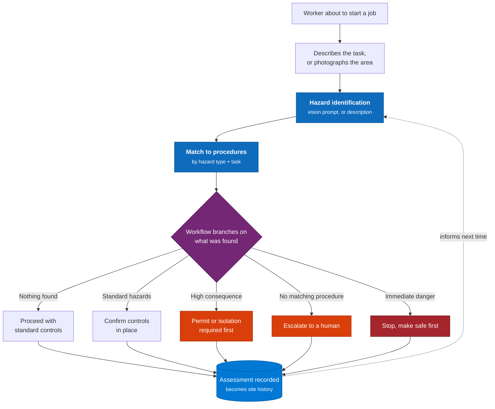

# Frontline Safety Copilot

**Proactive field safety, hazard identification from a photo**

Guided capture, automatic surfacing of the safe work method statement that applies, and a workflow
that branches on what was actually found.

---

## The problem

Frontline safety tooling is retrospective. It records incidents well and prevents them poorly.

The pattern is the same across every frontline organisation:

**Job safety analysis is a form completed after the fact.** A worker with their hands full, standing
in front of the job, has two minutes. A twelve-field form gets filled in at the end of the shift
from memory - which makes it a compliance artefact, not a safety control.

**The relevant procedure is in a document library nobody opens.** The safe work method statement for
working at height exists. It is thorough, it is correct, and it is thirty pages into a SharePoint
site that a worker on a loading dock will not open on a phone. The knowledge is present and the
access is not.

**Reporting is a burden, so it doesn't happen.** Near misses - the ones that predict the injury - go unreported, because reporting one costs more effort than the near miss cost.

**Everything is retrospective.** Incident data accumulates, gets reported on monthly, and describes
what already happened to someone.

## What this solves

| Problem | How this repo solves it |
|---|---|
| JSA completed after the job, from memory | Two-minute conversational pre-start, in the time available |
| Worker can't describe a hazard quickly | Photo-based hazard identification |
| SWMS in a library nobody opens | Matched controls surfaced automatically |
| Whole procedure presented, so none read | Only the controls relevant to this task |
| Every job gets the same checklist | Workflow branches on what was found |
| Near misses go unreported | Photo is a complete report; agent drafts the rest |
| AI reading confused with reporter's account | Kept in separate fields, permanently distinguishable |
| Hazard with no procedure quietly dropped | Unmatched hazards escalated as findings |

---

## What's in this repo

**This is an agent design and prompt reference, not a deployable solution.**

| Included | Not included |
|---|---|
| Two agent behaviours as `SKILL.md` files | A packaged solution or deployed agent |
| Vision and control-matching prompts (`prompts/hazardVision.js`) | Dataverse tables - schema is documented only |
| Dataverse schema documentation | A mobile app or PCF controls |
| Safety-specific design principles | A procedure/SWMS library |

The behaviours and prompts are complete and usable. Everything else is documentation.

**Verification status:** the capture patterns and photo-handling rules are generalised from a
production safety implementation. The **vision-based hazard identification and SWMS matching in this
repo have not been run** - the prompts encode the right constraints, but no accuracy testing against
a hazard taxonomy or procedure library has been done here.

> **This is safety tooling.** Validate against your own obligations, taxonomy and procedures before
> relying on any of it. The failure mode of a wrong answer is not an inconvenience.

---

## How it works

That last arrow matters. Today's assessment is what makes tomorrow's hazard identification better,
because previous events at this site are the strongest signal available.

---

## Photo-based hazard identification

A photo is often the fastest and most honest report available. Someone in a loading bay can show a
hazard in one second that would take two minutes to type.

It is also the easiest thing to get dangerously wrong, so the constraints are strict.

### What the model may not do

**It cannot confirm absence.** "No guard is visible in this image" is acceptable. "There is no
guard" is not. A photo is one angle at one moment, and a confident all-clear is the most dangerous
output this system could produce.

**It cannot state an area is safe.** It reports which hazards it identified and which controls
apply. Only the person standing there can say it is safe - and that is where the responsibility
belongs.

**It cannot infer cause, sequence or fault.** An image shows a state, not a story.

**It cannot assess a person.** Competence, behaviour and condition are not readable from a still.

**A clear photo is not a clear job.** Absence of an identified hazard is never presented as an
all-clear.

### The reporter always outranks the model

For incident reporting, the AI's reading of a photo goes in a **dedicated field**, never in the
description. The description belongs to the reporter, in their words, verbatim - including their
grammar, because how someone describes what happened to them is evidence.

Anyone reading the record months later can tell exactly which words came from the person and which
from the model. In an investigation, that distinction is everything.

If the model's reading appears to contradict the account, both are recorded and neither is asserted
over the other. It saw one frame; they were there.

---

## The emergency rule

Before anything else, in every capture path:

> If there is any indication someone is seriously hurt or in immediate danger - say to call
> emergency services, and stop.

No detail collection. No offering to create a record instead. A person deciding whether to call
should not be reading a form.

---

## Not manufacturing risk

A behaviour worth stating explicitly, because it is counter-intuitive to build:

**When nothing significant is found, say so and let them get on with it.**

A safety tool that manufactures risk to appear diligent gets ignored within a fortnight - and an
ignored safety tool is worse than none, because the organisation believes it has a control that
nobody uses.

Equally: **never talk someone out of stopping.** If a worker is hesitant, support stopping.

---

## Contents

| Path | Purpose |
|---|---|
| `agent/behaviors/job-safety-analysis.md` | Pre-work JSA with hazard identification and control matching |
| `agent/behaviors/report-safety-event.md` | Conversational incident capture with photo handling |
| `prompts/hazardVision.js` | Vision prompts and the control-matching prompt |
| `dataverse/README.md` | Schema for events, hazards, procedures and assessments |
| `docs/design-principles.md` | The safety-specific design constraints and why |

---

## Status

The capture patterns, photo-handling rules and agent behaviours are drawn from a production safety
implementation, generalised.

The vision-based hazard identification and SWMS matching are a **reference design** - the prompts
encode the right constraints, but accuracy against a specific hazard taxonomy and procedure library
needs validating in your own environment before it is relied on.

**Validate before deploying.** This is safety tooling. The failure mode of a wrong answer is not an
inconvenience.

---

## Licence

MIT - see [LICENSE](LICENSE).

**No warranty.** This is a reference implementation, not a certified safety system. You are
responsible for validating it against your own obligations, hazard taxonomy and procedures.
